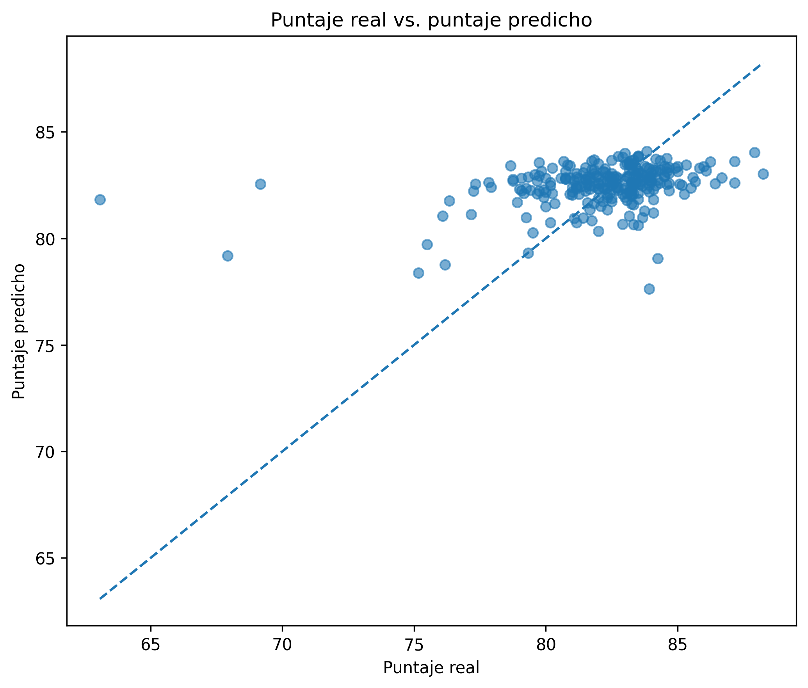
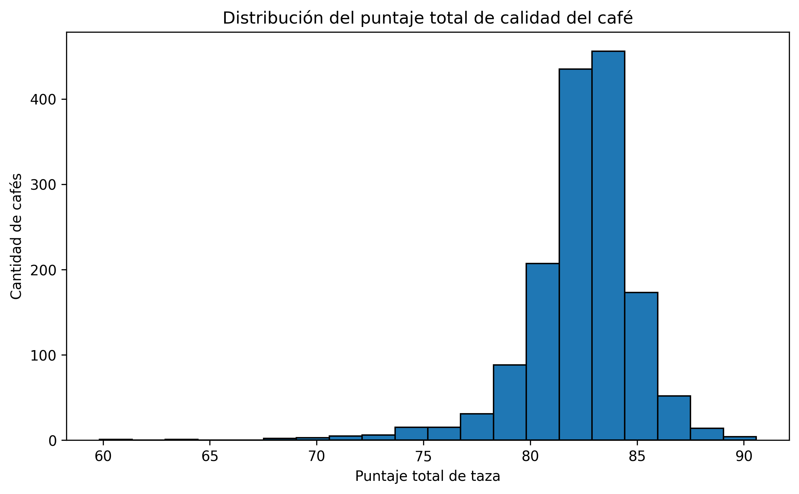
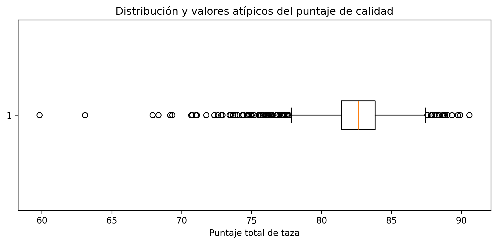

#  Calidad del café: análisis de factores asociados al puntaje sensorial

##  Descripción del proyecto

Este proyecto fue desarrollado como parte del curso de Ciencia de Datos y tiene como objetivo analizar qué características del café están relacionadas con su calidad y puntaje sensorial.

Se trabajó con datos reales de evaluaciones de café arábica provenientes del Coffee Quality Institute (CQI). El proyecto integra preparación de datos, análisis estadístico, visualización y un modelo predictivo simple.

##  Pregunta de análisis

**¿Qué características del café están relacionadas con su calidad y puntaje sensorial?**

##  Dataset

El conjunto de datos original contiene información relacionada con:

- País y región de origen.
- Altitud.
- Método de procesamiento.
- Humedad.
- Defectos del grano.
- Características sensoriales como aroma, sabor, acidez, cuerpo y balance.
- Puntaje total de taza (`Total_Cup_Points`).

Después del proceso de preparación se obtuvo un conjunto de **1.508 registros y 22 variables** relevantes para el análisis.

Fuente original: Coffee Quality Institute Reviews (May 2023), disponible en Kaggle.

## Etapa 1: preparación de los datos

Se realizó una exploración inicial para identificar tipos de variables, valores faltantes, duplicados e inconsistencias.

Entre las principales acciones realizadas se encuentran:

- Revisión de 1.509 registros y 42 variables originales.
- Identificación de valores faltantes.
- Verificación de registros duplicados.
- Revisión de inconsistencias en la variable de altitud.
- Eliminación de una evaluación sensorial inválida con puntajes registrados completamente en cero.
- Selección de 22 variables relevantes.
- Clasificación de valores categóricos faltantes como `No informado`.
- Conservación de valores numéricos faltantes cuando no existía evidencia suficiente para realizar una imputación.

El dataset preparado quedó conformado por **1.508 registros y 22 variables**.

##  Etapa 2: análisis estadístico

Para `Total_Cup_Points` se obtuvieron las siguientes medidas:

| Medida | Resultado |
|---|---:|
| Media | 82.39 |
| Mediana | 82.67 |
| Moda | 83.17 |
| Rango | 30.75 |
| Varianza | 6.92 |
| Desviación estándar | 2.63 |

También se analizaron relaciones entre diferentes características y el puntaje de calidad.

| Variable | Correlación con Total_Cup_Points |
|---|---:|
| Altitude | 0.200 |
| Moisture | -0.112 |
| Category One Defects | -0.150 |
| Category Two Defects | -0.299 |

Los resultados muestran asociaciones débiles entre las variables estudiadas y el puntaje. La mayor relación observada fue negativa entre los defectos de categoría 2 y la calidad.

El análisis de valores atípicos mostró la existencia de puntajes inusuales, principalmente en el extremo inferior de la distribución. Estos registros se conservaron al no existir evidencia suficiente para considerarlos errores.

## Etapa 3: modelo predictivo

Se desarrolló un modelo de **regresión lineal múltiple** para estimar `Total_Cup_Points`.

Variables utilizadas:

- `Altitude`
- `Moisture`
- `Category_One_Defects`
- `Category_Two_Defects`

Se utilizaron **1.259 registros completos**, divididos en:

- 1.007 registros para entrenamiento.
- 252 registros para prueba.

### Resultados del modelo

| Métrica | Resultado |
|---|---:|
| MAE | 1.71 |
| RMSE | 2.56 |
| R² | 0.116 |

El modelo presenta un error absoluto medio de aproximadamente **1.71 puntos** y explica cerca del **11.6 % de la variabilidad** del puntaje en los datos de prueba.

Los resultados indican que las características analizadas aportan información sobre la calidad, pero no son suficientes por sí solas para predecir con alta precisión el puntaje sensorial.

###  Evaluación visual del modelo

La comparación entre los valores reales y predichos muestra que el modelo tiende a concentrar sus estimaciones alrededor de los puntajes medios y presenta mayores dificultades para representar valores extremos.

###  Visualizaciones principales

#### Distribución del puntaje de calidad

La mayor parte de las evaluaciones se concentra alrededor de los 80–85 puntos, aunque se observa una mayor extensión hacia los puntajes bajos.

#### Identificación de valores atípicos

El diagrama de cajas permite identificar valores atípicos, principalmente en los puntajes inferiores. Estos valores se conservaron debido a que no existe evidencia suficiente para considerarlos errores.

## Aplicación profesional

Desde la Ingeniería Química, este tipo de análisis puede aplicarse al control de calidad de materias primas y procesos.

El análisis de variables físicas, condiciones de procesamiento y características del producto permite identificar tendencias y apoyar decisiones relacionadas con selección de materias primas, control de procesos y calidad del producto final.

Además, los resultados del modelo muestran la importancia de evaluar críticamente el desempeño de las herramientas predictivas antes de utilizarlas como apoyo para la toma de decisiones.

## Herramientas utilizadas

- Python
- Pandas
- NumPy
- Matplotlib
- Scikit-learn
- Google Colab
- GitHub

## Archivos del repositorio

- `Proyecto_Calidad_Cafe.ipynb`: notebook con el desarrollo completo del análisis.
- `coffee_quality_limpio.csv`: conjunto de datos preparado utilizado durante el proyecto.
- `README.md`: documentación general del proyecto.
  
### Fuente de los datos

Los datos utilizados provienen del dataset **Coffee Quality Institute Reviews (May 2023)**, publicado en Kaggle y basado en evaluaciones del Coffee Quality Institute (CQI).

🔗 [Consultar dataset original en Kaggle](https://www.kaggle.com/datasets/erwinhmtang/coffee-quality-institute-reviews-may2023)

## Autores

Proyecto desarrollado por estudiantes de Ingeniería de la Universidad EAN como parte del curso de Ciencia de Datos.
